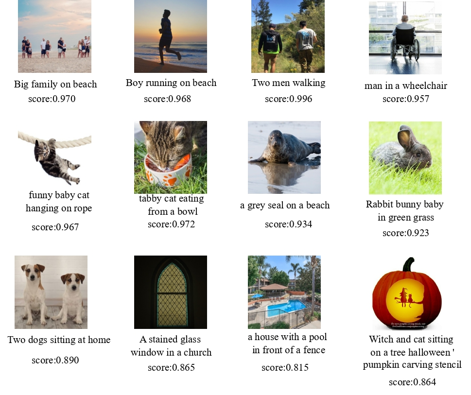

# [AAAI 2025] EcoDatum: Quality over Quantity: Boosting Data Efficiency Through Ensembled Multimodal Data Curation
[](https://arxiv.org/abs/2502.08211)
[](https://github.com/Daming-W/EcoDatum)


This repository provides the implementation of **EcoDatum**, a data curation framework introduced in the paper [Quality over Quantity: Boosting Data Efficiency Through Ensembled Multimodal Data Curation](https://arxiv.org/abs/2502.08211). EcoDatum enhances dataset quality by integrating various unimodal and multimodal data curation operators within a weak supervision ensemble framework, leading to improved model training efficiency.

## 💥 News
- **2025/04:** [Print Version](https://ojs.aaai.org/index.php/AAAI/article/view/35481) is released.
- **2025/03:** Code is released.
- **2025/02:** Paper is published on the [ArXiv](https://arxiv.org/abs/2412.05435).
- **2024/12:** Paper is accepted at the [AAAI 2025](https://aaai.org/wp-content/uploads/2025/01/AAAI-25-Poster-Schedule.pdf).
- **2024/08:** SOTA on the [Datacomp Leaderboard](https://www.datacomp.ai/dcclip/leaderboard.html).

## Table of Contents

- [Introduction](#introduction)
- [Features](#features)
- [Installation](#installation)
- [Usage](#usage)
- [Achievement](#achievement)
- [Contributing](#contributing)
- [License](#license)

## Introduction

In the era of big data, effectively curating web-crawled datasets is crucial for optimizing model performance. Traditional heuristic curation methods often fail to capture complex features, leading to biases and the exclusion of relevant data. EcoDatum addresses these challenges by strategically integrating various data curation operators within a weak supervision ensemble framework, utilizing automated optimization to score each data point effectively. This approach significantly improves data curation quality and efficiency, outperforming existing state-of-the-art techniques.


<table>
  <tr>
    <td align="center">
      <br/>
      <sub>Bad Data</sub>
    </td>
    <td align="center">
      <br/>
      <sub>Good Data</sub>
    </td>
  </tr>
</table>

## Features

- **Ensembled Multimodal Data Curation**: Combines multiple data curation operators to enhance dataset quality.
- **Quality-Guided Deduplication**: Ensures balanced feature distributions by removing redundant data based on quality metrics.
- **Automated Optimization**: Utilizes a composite metric and a small labeled dataset to fine-tune the integration of curation operators.
- **Improved Model Training Efficiency**: Demonstrated to enhance model performance across diverse evaluation datasets.
  


## Installation

To use EcoDatum, clone this repository and install the required dependencies:

```bash
git clone git@github.com:Daming-W/ecodatum.git
cd ecodatum
conda env create -f environment.yml
```
or
```bash
pip install -r requirements.txt
```

## Usage

EcoDatum can be used to curate datasets before training visual-language models. Here's a basic example of how to apply EcoDatum to your dataset:

### STEP 1  – Prepare Example Assets

Place your dataset with JSONL into `examples/data/` — follow the same file structure used in the `examples/` template.

Read the operator description in `Vaquitai/README.md` and choose the operators you need.

Run the selected operators to produce prediction files (JSONL) and move them to `examples/ops_results/`.

### STEP 2  – Configure the Recipe

Edit the YAML under `examples/config/`:

- `data_path`: absolute or relative path to the files in `examples/data/`.

- `ops_results_path`: pointing to the JSONL files in `examples/ops_results/`.

Any operator‑specific thresholds or parameters.

### STEP 3  – Define Labeling Functions (LFs) (Optional)

- Option A - Apply pre-defined LFs: check `labeling_functions.py`, EcoDatum provides few pre-defined LFs, you may want to try different parameters combinations!

- Option B – Apply your own LFs: open `labeling_functions.py` and add lfs whatever you like that refs to the operators you inferenced with at step 1! 

Make sure each LF is added to the 'lfs' list of `ensemble.py`.

**Tip**: Keep LF names self‑explanatory; this helps when reading the LFAnalysis summary.

### STEP 4  – Run the Ensembler

```bash
python ensemble.py --config examples/config/your_config.yaml
```
Output:
```bash
examples/output/curated_dataset.jsonl
```

A curated dataset (JSONL) is saved to examples/output/.


## Achievement

EcoDatum has been evaluated on the [DataComp leaderboard](https://www.datacomp.ai/dcclip/leaderboard.html), achieving an average performance score of 0.182 across 38 diverse evaluation datasets. This represents a 28% improvement over the DataComp baseline method, demonstrating its effectiveness in improving dataset curation and model training efficiency.

## Contributing

We welcome contributions to EcoDatum! If you'd like to contribute, please fork the repository and use a feature branch. Pull requests are warmly welcome.

## License

This project is licensed under the MIT License. See the LICENSE file for details.

---

For more information, please refer to our [paper](https://arxiv.org/abs/2502.08211).
